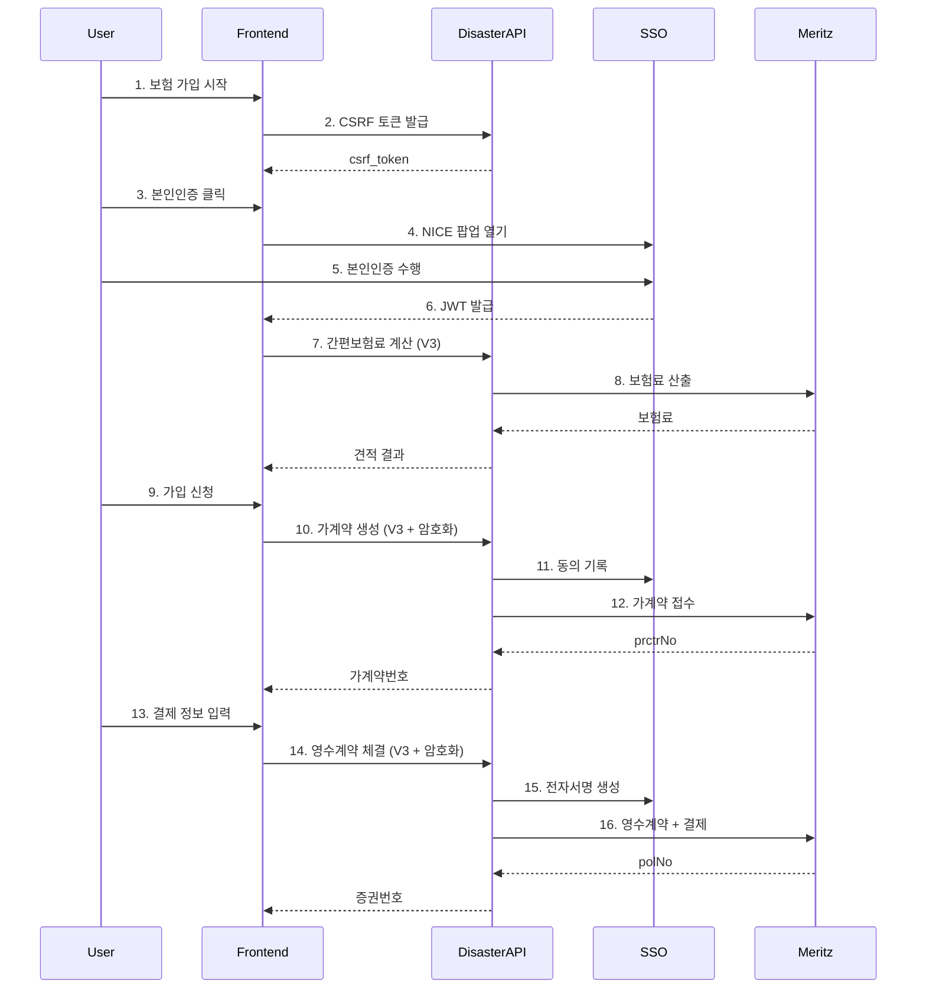

# 풍수해보험 프론트엔드 완전 가이드

> **작성일**: 2025-11-27
> **대상**: 풍수해보험 프론트엔드 개발자
> **버전**: V3 API (최신)

---

## 🚨 중요 공지

**V3 API 필수 사용**: 2025-11-27부터 V1/V2 API는 athNo 에러로 사용 불가

- ✅ **V3 API**: SSO 본인인증 + 암호화 + 자동 동의/서명
- ❌ **V2 API**: athNo 필드 크기 초과 에러 (사용 불가)
- ❌ **V1 API**: 암호화 없음 (개발용으로만 사용)

---

## 📚 목차

1. [개요](#개요)
2. [기술 스택](#기술-스택)
3. [전체 플로우](#전체-플로우)
4. [Step 1: 초기 설정](#step-1-초기-설정)
5. [Step 2: CSRF 토큰](#step-2-csrf-토큰)
6. [Step 3: 본인인증](#step-3-본인인증)
7. [Step 4: 간편보험료 계산](#step-4-간편보험료-계산)
8. [Step 5: 가계약 생성](#step-5-가계약-생성)
9. [Step 6: 영수계약 체결](#step-6-영수계약-체결)
10. [암호화 가이드](#암호화-가이드)
11. [에러 처리](#에러-처리)
12. [체크리스트](#체크리스트)

---

## 개요

### 서비스 구성

```
[프론트엔드]
    ↓
[Nginx 프록시]
    ↓
[풍수해보험 API (mrz_disaster)]  - 포트 38100/38101
    ↓
[SSO 본인인증 서버]             - 포트 39100
    ↓
[메리츠 API]                    - 외부 API
```

### 환경별 Base URL

| 환경 | 풍수해보험 API | SSO API |
|------|--------------|---------|
| **개발** | `http://localhost:38101/api/v3` | `http://localhost:39100` |
| **스테이징** | `https://stage.retrust.world/disaster-api/api/v3` | `https://stage.retrust.world/sign-api` |
| **프로덕션** | `https://retrust.world/disaster-api/api/v3` | `https://retrust.world/sign-api` |

---

## 기술 스택

### 필수 라이브러리

```html
<!-- 암호화 -->
<script src="https://cdn.jsdelivr.net/npm/node-forge@1.3.1/dist/forge.min.js"></script>

<!-- 암호화 클라이언트 -->
<script src="/disaster-api/js/cryptoClientV2.js"></script>
```

### NPM 설치

```bash
npm install node-forge axios
```

---

## 전체 플로우



---

## Step 1: 초기 설정

### 1.1 환경 변수 설정

```javascript
// config.js
const ENV = {
  development: {
    DISASTER_API_URL: 'http://localhost:38101/api/v3',
    SSO_API_URL: 'http://localhost:39100',
    CRYPTO_URL: 'http://localhost:38101'
  },
  production: {
    DISASTER_API_URL: 'https://retrust.world/disaster-api/api/v3',
    SSO_API_URL: 'https://retrust.world/sign-api',
    CRYPTO_URL: 'https://retrust.world/disaster-api'
  }
};

const config = ENV[process.env.NODE_ENV || 'development'];
export default config;
```

### 1.2 암호화 클라이언트 초기화

```javascript
// app.js (애플리케이션 시작 시)
import config from './config.js';

// 전역 암호화 클라이언트
let cryptoClient = null;

async function initializeApp() {
  // 1. 암호화 클라이언트 생성
  cryptoClient = new CryptoClientV2({
    publicKeyUrl: `${config.CRYPTO_URL}/api/v1/crypto/public-key`
  });

  // 2. 공개키 로드
  await cryptoClient.initialize();
  console.log('✅ 암호화 준비 완료');

  // 3. 앱 시작
  renderApp();
}

// 페이지 로드 시 초기화
document.addEventListener('DOMContentLoaded', initializeApp);
```

---

## Step 2: CSRF 토큰

### 2.1 토큰 발급

```javascript
// csrfService.js
export async function getCsrfToken() {
  // localStorage에 저장된 토큰 확인
  const cachedToken = localStorage.getItem('csrfToken');
  const expiresAt = localStorage.getItem('csrfTokenExpires');

  if (cachedToken && expiresAt && new Date(expiresAt) > new Date()) {
    return cachedToken;
  }

  // 새 토큰 발급
  const response = await fetch(`${config.DISASTER_API_URL}/csrf-token`);
  const { data } = await response.json();

  // localStorage에 저장
  localStorage.setItem('csrfToken', data.csrf_token);
  const expires = new Date(Date.now() + data.expires_in * 1000);
  localStorage.setItem('csrfTokenExpires', expires.toISOString());

  return data.csrf_token;
}
```

### 2.2 모든 POST 요청에 포함

```javascript
// apiClient.js
export async function post(url, data) {
  const csrfToken = await getCsrfToken();

  const response = await fetch(url, {
    method: 'POST',
    headers: {
      'Content-Type': 'application/json',
      'X-CSRF-Token': csrfToken
    },
    body: JSON.stringify(data)
  });

  return response.json();
}
```

---

## Step 3: 본인인증

### 3.1 NICE 본인인증 팝업 열기

```javascript
// ssoService.js
export function openNiceAuth(purpose = 'default') {
  const width = 500;
  const height = 600;
  const left = (screen.width - width) / 2;
  const top = (screen.height - height) / 2;

  const popup = window.open(
    `${config.SSO_API_URL}/nice/checkplus_main?purpose=${purpose}&client_id=mrz_disaster`,
    'niceAuth',
    `width=${width},height=${height},left=${left},top=${top}`
  );

  return new Promise((resolve, reject) => {
    // postMessage 이벤트 리스너
    const handleMessage = (event) => {
      // 출처 검증
      if (!event.origin.includes('retrust.world')) return;

      const { success, token, error, userData } = event.data;

      if (success && token) {
        // JWT 저장
        localStorage.setItem('verificationToken', token);
        localStorage.setItem('verificationData', JSON.stringify(userData));

        window.removeEventListener('message', handleMessage);
        resolve({ token, userData });
      } else {
        window.removeEventListener('message', handleMessage);
        reject(new Error(error?.message || '본인인증에 실패했습니다.'));
      }
    };

    window.addEventListener('message', handleMessage);

    // 팝업 닫힘 감지
    const timer = setInterval(() => {
      if (popup.closed) {
        clearInterval(timer);
        window.removeEventListener('message', handleMessage);
        reject(new Error('본인인증 팝업이 닫혔습니다.'));
      }
    }, 500);
  });
}
```

### 3.2 본인인증 버튼 클릭 핸들러

```javascript
// pages/insurance/index.js
async function handleNiceAuth() {
  try {
    showLoading('본인인증 진행 중...');

    const { token, userData } = await openNiceAuth('insurance');

    console.log('✅ 본인인증 완료:', userData);
    alert(`${userData.name}님 본인인증이 완료되었습니다.`);

    // 다음 단계로 진행
    goToNextStep();

  } catch (error) {
    console.error('❌ 본인인증 실패:', error);
    alert(error.message);
  } finally {
    hideLoading();
  }
}
```

### 3.3 토큰 유효성 확인

```javascript
export function getVerificationToken() {
  const token = localStorage.getItem('verificationToken');
  const userData = localStorage.getItem('verificationData');

  if (!token) {
    throw new Error('본인인증이 필요합니다.');
  }

  // 토큰 유효기간 확인 (30분)
  const data = JSON.parse(userData);
  const verifiedAt = new Date(data.verifiedAt);
  const now = new Date();
  const diff = (now - verifiedAt) / 1000 / 60; // 분

  if (diff > 30) {
    localStorage.removeItem('verificationToken');
    localStorage.removeItem('verificationData');
    throw new Error('본인인증이 만료되었습니다. 다시 인증해주세요.');
  }

  return token;
}
```

---

## Step 4: 간편보험료 계산

### 4.1 V3 API 호출

```javascript
// insuranceService.js
export async function calculatePremium(formData) {
  const csrfToken = await getCsrfToken();

  const response = await fetch(`${config.DISASTER_API_URL}/disaster/premium`, {
    method: 'POST',
    headers: {
      'Content-Type': 'application/json',
      'X-CSRF-Token': csrfToken
    },
    body: JSON.stringify({
      pdCd: formData.productCode,          // "17605" 또는 "17604"
      inspeStrtDt: formData.startDate,      // "20251201"
      inspeEndDt: formData.endDate,         // "20261130"
      buildingArea: formData.area,          // 건물 면적
      buildingType: formData.buildingType,  // 건물 유형
      regionCode: formData.regionCode       // 지역 코드
    })
  });

  const result = await response.json();

  if (!result.success) {
    throw new Error(result.data.errMsg);
  }

  return {
    premium: result.data.aplPrem,    // 보험료
    tranId: result.tranId            // 거래 ID
  };
}
```

### 4.2 사용 예시

```javascript
async function handleCalculate() {
  try {
    const premium = await calculatePremium({
      productCode: '17605',
      startDate: '20251201',
      endDate: '20261130',
      area: 100,
      buildingType: 'A',
      regionCode: '1100'
    });

    console.log('📊 보험료:', premium.premium);
    displayPremium(premium.premium);

  } catch (error) {
    alert('보험료 계산 실패: ' + error.message);
  }
}
```

---

## Step 5: 가계약 생성

### 5.1 민감 정보 암호화

```javascript
async function createProvisionalContract(formData) {
  // 1. 본인인증 토큰 확인
  const verificationToken = getVerificationToken();
  const csrfToken = await getCsrfToken();

  // 2. 민감 정보 암호화 (주민번호, 이메일, 연락처)
  const encryptedFields = await cryptoClient.encryptHybrid({
    polhdRsidNo: formData.residentNumber,      // 계약자 주민번호
    inspeRsidNo: formData.residentNumber,      // 피보험자 주민번호 (동일인)
    polhdEmailAdrVal: formData.email,          // 이메일
    polhdCellNo: formData.phone                // 연락처
  });

  // 3. V3 API 호출
  const response = await fetch(`${config.DISASTER_API_URL}/disaster/premium/provisional`, {
    method: 'POST',
    headers: {
      'Content-Type': 'application/json',
      'X-CSRF-Token': csrfToken,
      'X-Verification-Token': verificationToken  // ⭐ V3 필수
    },
    body: JSON.stringify({
      // 평문 필드
      pdCd: formData.productCode,
      polhdNm: formData.name,
      inspeStrtDt: formData.startDate,
      inspeEndDt: formData.endDate,
      // ... 기타 필드

      // 암호화된 필드
      encryptedFields: encryptedFields
    })
  });

  const result = await response.json();

  if (!result.success) {
    throw new Error(result.data.errMsg);
  }

  return {
    prctrNo: result.data.prctrNo,    // 가계약번호
    tranId: result.tranId
  };
}
```

### 5.2 사용 예시

```javascript
async function handleProvisionalContract() {
  try {
    showLoading('가계약 처리 중...');

    const result = await createProvisionalContract({
      productCode: '17605',
      name: '홍길동',
      residentNumber: '8708091234567',
      email: 'hong@example.com',
      phone: '010-1234-5678',
      startDate: '20251201',
      endDate: '20261130'
    });

    console.log('✅ 가계약번호:', result.prctrNo);

    // 가계약번호 저장
    sessionStorage.setItem('prctrNo', result.prctrNo);

    // 결제 페이지로 이동
    goToPaymentPage();

  } catch (error) {
    handleError(error);
  } finally {
    hideLoading();
  }
}
```

---

## Step 6: 영수계약 체결

### 6.1 결제 정보 암호화

```javascript
async function finalizeContract(prctrNo, paymentInfo) {
  // 1. 본인인증 토큰 확인
  const verificationToken = getVerificationToken();
  const csrfToken = await getCsrfToken();

  // 2. 결제 정보 암호화
  const encryptedPayment = await cryptoClient.encryptHybrid({
    crdNo: paymentInfo.cardNumber,           // 카드번호 (16자리)
    cardValidTerm: paymentInfo.expiryDate,   // 유효기간 (YYMM)
    instlmCnt: paymentInfo.installment,      // 할부개월 (00=일시불)
    cardPwd: paymentInfo.cardPassword,       // 카드비밀번호 앞 2자리
    dporCd: paymentInfo.birthDate            // 생년월일 또는 사업자번호 (6자리)
  });

  // 3. V3 API 호출
  const response = await fetch(`${config.DISASTER_API_URL}/disaster/contract`, {
    method: 'POST',
    headers: {
      'Content-Type': 'application/json',
      'X-CSRF-Token': csrfToken,
      'X-Verification-Token': verificationToken  // ⭐ V3 필수
    },
    body: JSON.stringify({
      prctrNo: prctrNo,
      encryptedFields: encryptedPayment  // V3 API: encryptedFields 필드명 사용
    })
  });

  const result = await response.json();

  if (!result.success) {
    throw new Error(result.data.errMsg);
  }

  return {
    polNo: result.data.polNo,        // 증권번호
    tranId: result.tranId,
    signatureId: result.signatureId  // 전자서명 ID (V3 자동 생성)
  };
}
```

### 6.2 사용 예시

```javascript
async function handlePayment() {
  try {
    showLoading('결제 처리 중...');

    const prctrNo = sessionStorage.getItem('prctrNo');

    const result = await finalizeContract(prctrNo, {
      cardNumber: '1234567812345678',
      expiryDate: '2512',
      installment: '00',
      cardPassword: '12',
      birthDate: '870809'
    });

    console.log('✅ 증권번호:', result.polNo);
    console.log('📝 전자서명 ID:', result.signatureId);

    // 완료 페이지로 이동
    goToCompletePage(result.polNo);

  } catch (error) {
    handleError(error);
  } finally {
    hideLoading();
  }
}
```

---

## 암호화 가이드

### 하이브리드 암호화 원리

```
평문 데이터
    ↓
1. AES-256-CBC 암호화 (랜덤 AES 키 생성)
    ↓
2. AES 키를 RSA-2048 공개키로 암호화
    ↓
전송: { encryptedKey, encryptedData }
```

### 암호화 필드별 가이드

| 필드 | 설명 | 형식 | 예시 |
|------|------|------|------|
| `polhdRsidNo` | 계약자 주민번호 | 13자리 | `8708091234567` |
| `inspeRsidNo` | 피보험자 주민번호 | 13자리 | `8708091234567` |
| `polhdEmailAdrVal` | 이메일 | 이메일 | `test@example.com` |
| `polhdCellNo` | 연락처 | 하이픈 포함 | `010-1234-5678` |
| `crdNo` | 카드번호 | 16자리 | `1234567812345678` |
| `cardValidTerm` | 카드 유효기간 | YYMM | `2512` |
| `instlmCnt` | 할부개월 | 00~12 | `00` (일시불) |
| `cardPwd` | 카드 비밀번호 | 앞 2자리 | `12` |
| `dporCd` | 생년월일/사업자번호 | 6자리 또는 10자리 | `870809` |

### CryptoClientV2 API

```javascript
// 초기화
const crypto = new CryptoClientV2({
  publicKeyUrl: 'https://retrust.world/disaster-api/api/v1/crypto/public-key'
});
await crypto.initialize();

// 하이브리드 암호화 (가장 많이 사용)
const encrypted = await crypto.encryptHybrid({
  field1: 'value1',
  field2: 'value2'
});
// 결과: { encryptedKey: "...", encryptedData: "..." }

// AES 암호화만 (고급 사용)
const { encryptedData, aesKey } = await crypto.encryptAES(data);

// RSA 암호화만 (고급 사용)
const encryptedKey = await crypto.encryptRSA(aesKey);
```

---

## 에러 처리

### 공통 에러 핸들러

```javascript
// errorHandler.js
export function handleError(error) {
  console.error('❌ 에러 발생:', error);

  // 본인인증 관련 에러
  if (error.message.includes('본인인증')) {
    alert('본인인증이 필요합니다.');
    openNiceAuth('insurance');
    return;
  }

  // CSRF 토큰 에러
  if (error.message.includes('CSRF')) {
    localStorage.removeItem('csrfToken');
    location.reload();
    return;
  }

  // 메리츠 API 에러
  if (error.data && error.data.errCd) {
    const errMsg = MERITZ_ERROR_CODES[error.data.errCd] || error.data.errMsg;
    alert(`처리 중 오류가 발생했습니다.\n${errMsg}`);
    return;
  }

  // 일반 에러
  alert(error.message || '알 수 없는 오류가 발생했습니다.');
}
```

### 메리츠 에러 코드

```javascript
const MERITZ_ERROR_CODES = {
  '53012': '필수 입력 항목이 누락되었습니다.',
  '53015': '입력 값의 형식이 올바르지 않습니다.',
  '69999': '시스템 오류가 발생했습니다. 잠시 후 다시 시도해주세요.',
  '70001': '가계약 정보 저장에 실패했습니다.',
  '70002': '영수계약 정보 저장에 실패했습니다.'
};
```

### 에러 응답 형식

```javascript
// V3 API 에러 응답
{
  "success": false,
  "tranId": "RETRUST202511271234560001",
  "data": {
    "errCd": "53012",
    "errMsg": "'dporCd' 항목에 대한 요청 값이 NULL일 수 없습니다."
  }
}
```

---

## 체크리스트

### 프로젝트 설정
- [ ] node-forge 라이브러리 설치
- [ ] CryptoClientV2.js 파일 추가
- [ ] 환경 변수 설정 (DISASTER_API_URL, SSO_API_URL)
- [ ] 암호화 클라이언트 초기화

### 본인인증
- [ ] NICE 팝업 열기 구현
- [ ] postMessage 이벤트 리스너 등록
- [ ] JWT 토큰 localStorage 저장
- [ ] 토큰 유효기간 확인 (30분)

### API 연동
- [ ] CSRF 토큰 발급 및 캐싱
- [ ] 모든 POST 요청에 `X-CSRF-Token` 헤더 포함
- [ ] V3 API에 `X-Verification-Token` 헤더 포함
- [ ] 간편보험료 계산 API 연동
- [ ] 가계약 생성 API 연동 (암호화)
- [ ] 영수계약 체결 API 연동 (암호화)

### 암호화
- [ ] 가계약: 주민번호, 이메일, 연락처 암호화
- [ ] 영수계약: 카드번호, 유효기간, 비밀번호, 생년월일 암호화
- [ ] `encryptHybrid()` 메서드 사용
- [ ] 암호화 결과 `{ encryptedKey, encryptedData }` 형식 확인

### 에러 처리
- [ ] 본인인증 에러 처리
- [ ] CSRF 토큰 에러 처리
- [ ] 메리츠 API 에러 코드 매핑
- [ ] 사용자 친화적 에러 메시지 표시

### UI/UX
- [ ] 로딩 인디케이터 표시
- [ ] 본인인증 필수 안내
- [ ] 암호화 진행 상황 표시
- [ ] 성공/실패 메시지 표시
- [ ] 가계약번호 표시
- [ ] 증권번호 표시

---

## 참고 자료

### 내부 문서
- [SSO 본인인증 상세 가이드](/home/waffle/sso-auth-server/docs/FRONTEND_INTEGRATION_GUIDE_PHASE_5_5.md)
- [메리츠 API 명세](./MERITZ_DISASTER_API_SPEC.md)
- [데이터베이스 스키마](./DATABASE_SCHEMA_FINAL_V3.md)

### 외부 문서
- [node-forge 공식 문서](https://github.com/digitalbazaar/forge)
- [NICE 본인인증 가이드](https://www.niceid.co.kr)

---

## 변경 이력

| 날짜 | 버전 | 변경 내용 |
|------|------|----------|
| 2025-12-19 | 1.1 | encryptedPayment → encryptedFields 필드명 수정 (실제 PaymentContract.js 스펙 반영) |
| 2025-11-27 | 1.0 | 최초 작성 (V3 API 기준) |

---

**문의**: 백엔드 개발팀
